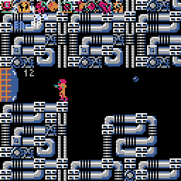

# ミニメトロイド

[メトロイド](https://www.nintendo.com/jp/famicom/software/fmc-met/index.html)を参考にしました。

## 操作方法

* キーボード、又はゲームパッドで操作します。
  * 【Z】【CTRL】・・・ジャンプ（ゲームパッドのAボタン／Yボタン）
  * 【X】【SHIFT】・・・攻撃（ゲームパッドのBボタン／Xボタン）
  * 【←】【→】・・・左右移動（ゲームパッドの十字キー）
  * 【↑】・・・銃を上に向ける（ゲームパッドの十字キー）
  * 【↓】・・・丸まる（ゲームパッドの十字キー）

## 遊び方

* アイテムを集めましょう。
* そして、小ボス（クレイド、リドリー）を倒しましょう。
* 最後に、マザーブレインを倒して、脱出しましょう。

## 特徴

* アイスビーム、波動ビーム、スクリューアタックはありません。
* ミサイルを集めると、ビームがパワーアップします。
  * 赤や黄色のゲートを壊せるようになります。

